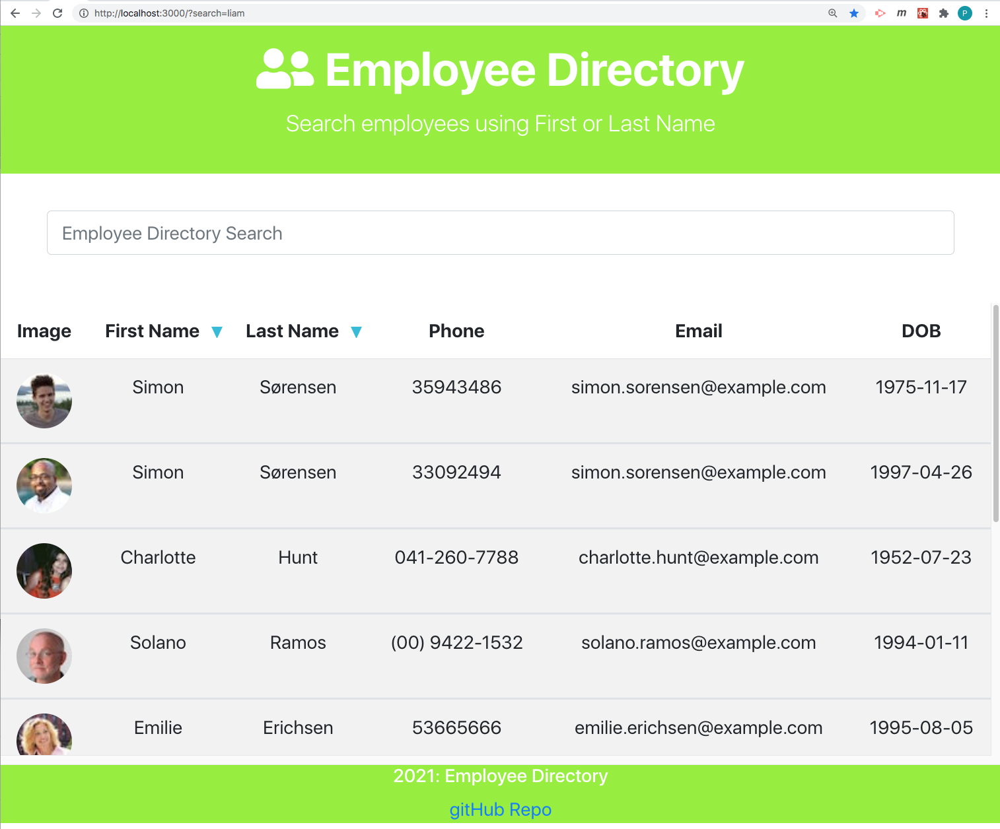
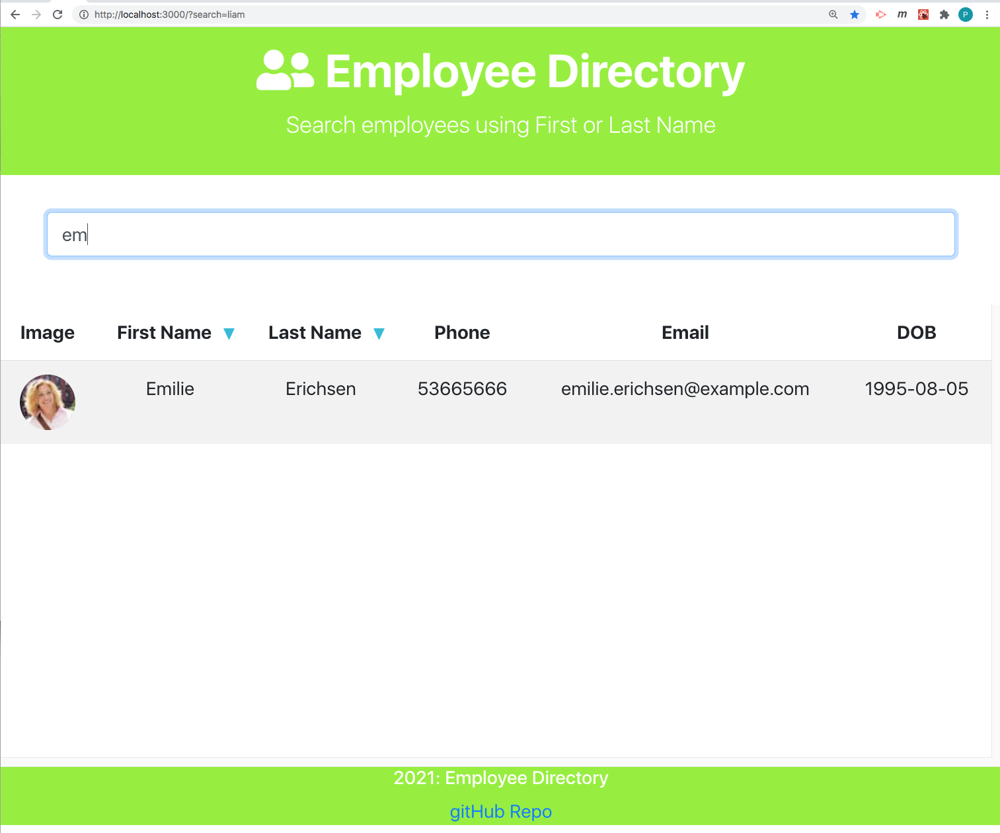
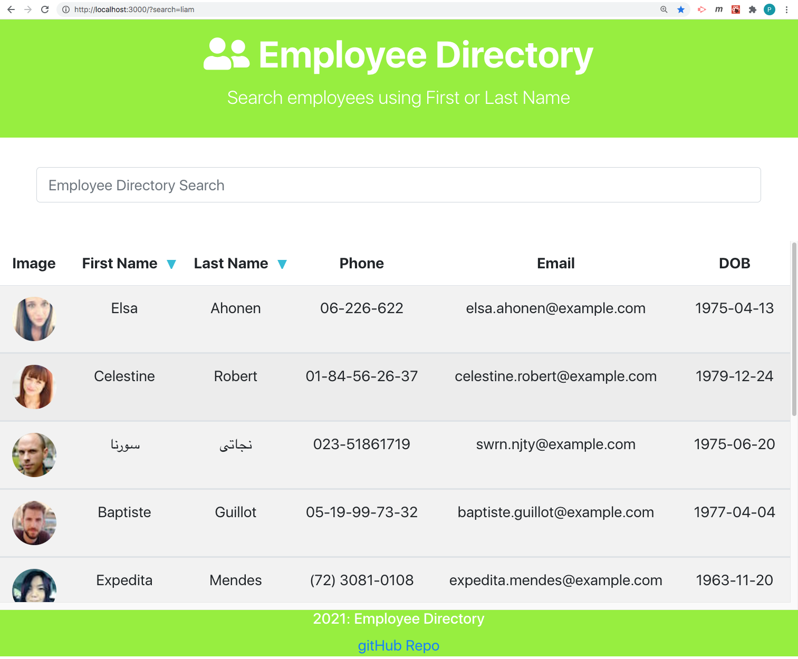
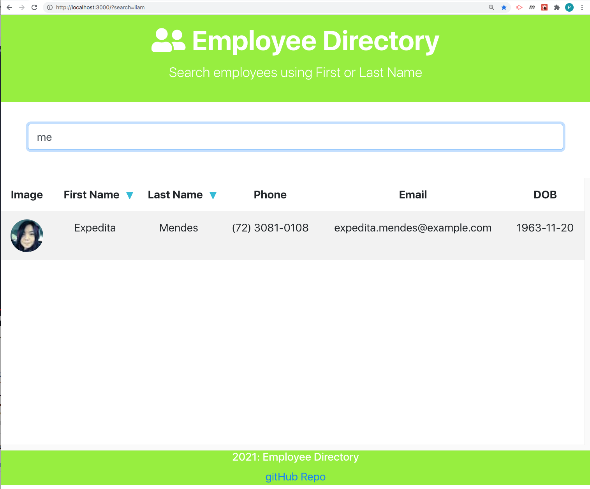

# Project Title: HW 19-employee-directory
    
  ## Table of Contents:
  - [Project Description](#project-description)
  - [Installation Instructions](#installation-instructions)
  - [Project Usage Information](#project-usage-information)
  - [Contribution Guidelines](#contribution-guidelines)
  - [License Type](#license-type)
  - [Github Repo Link](#github-repo-link)
  - [HEROKU Live APP Link](https://streamingturtles.github.io/19-employee-directory/)
  - [Github Information](#github-information)
  - [my-email-for-questions-and-information](#my-email-for-questions-and-information)

  - - -
 
  ## Screenshot of App: (search using first name - shown next):
  
   
  ## Screenshot of name search about the first name:
  
  
  ## Screenshot of Refreshed page: (now search using last name - shown next):
  
   
  ## Screenshot of name search about the last name:
  

 

  &nbsp;
  - - -
  ## Project Description:
  - This is an React application running on gitHub pages that renders an employee directory from the [Random User API](https://randomuser.me/) website. The app renders random users from which you can search via first and last name.  The app can also sort the employee list in either ascending or descending order about the first or last names.  When the page is refreshed, the app recycles the apiSearch with a new random employee list.  The app also implements updating yearly to the currnent Year, as represented in the footer.  The application runs locally on localhost as well as on github pages. Example screenshots are shown.

  &nbsp;
  - - -
  ## Installation Instructions:
  - The user only has to follow the Github Deployed Application link https://streamingturtles.github.io/19-employee-directory/  or can run the application locally from the terminal by first running >npm i to get all dependencies and then to begin the app, type:  >npm start  and the Employee Directory App will open in the browser.  

  &nbsp;
  - - -
  ## Project Usage Information:
  - To be able to view and sort a random employee directory, either running locally or running online hosted by gitHub.

  &nbsp;
  - - -
  ## Contribution Guidelines:
  - I made this, PAC with Streaming Turtles, LLC

  &nbsp;
  - - -
  ## License Type:
  - 

  &nbsp;
  - - -
  ## gitHub Repo Link:
  - https://github.com/streamingTurtles/19-employee-directory

  &nbsp;
  - - -
  ## GitHub pages Live Application URL:
  - https://streamingturtles.github.io/19-employee-directory/

  &nbsp;
  - - -
  ## Github Information:

  
- user name: streamingTurtles
- [GitHub Profile](https://github.com/streamingTurtles)

  ## my-email-for-questions-and-information:
  - pcardillo@streamingTurtles.com  

  &nbsp;
- - -
- - -
Peter Cardillo, Columbia Engineering Fullstack Bootcamp, 2020-2021  

